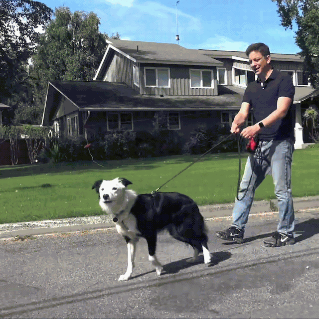
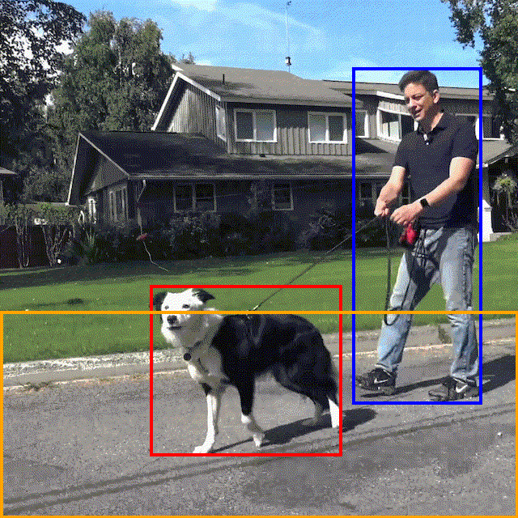
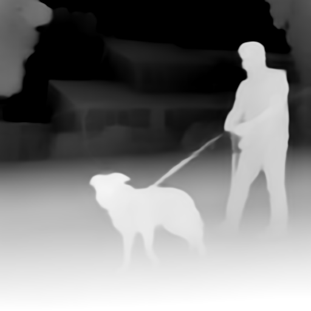
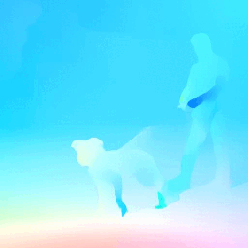
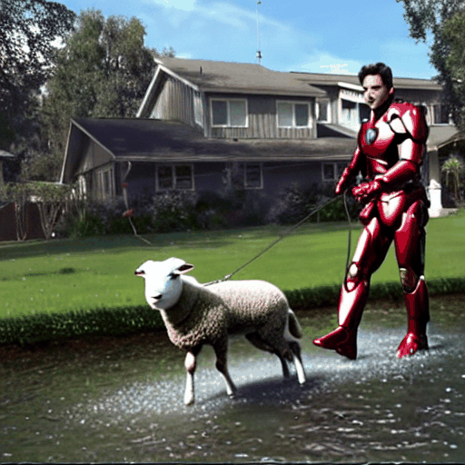
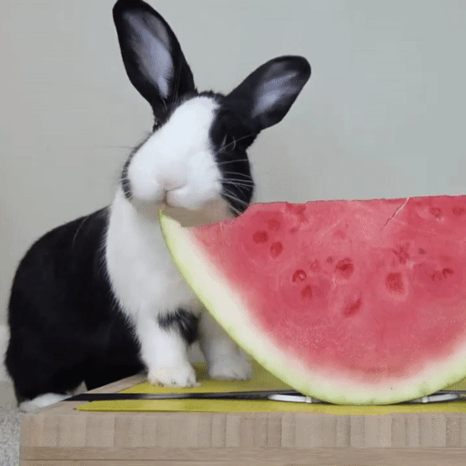
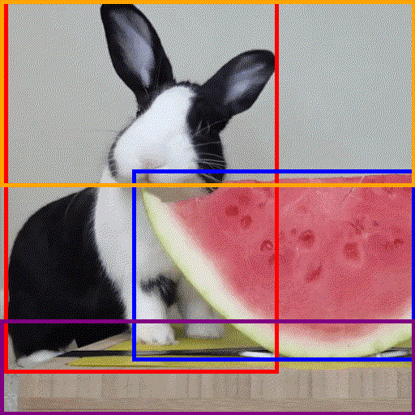
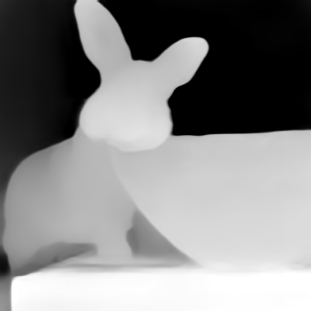
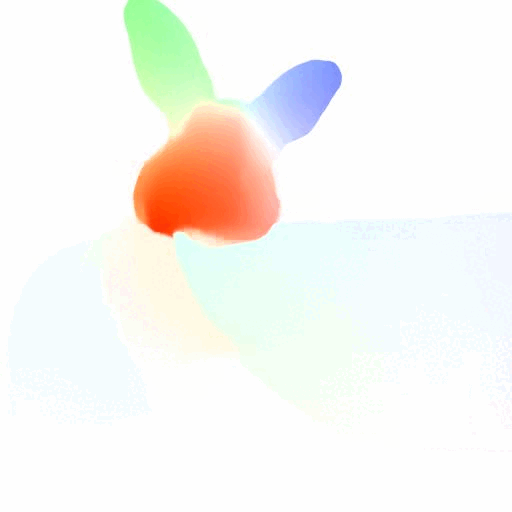
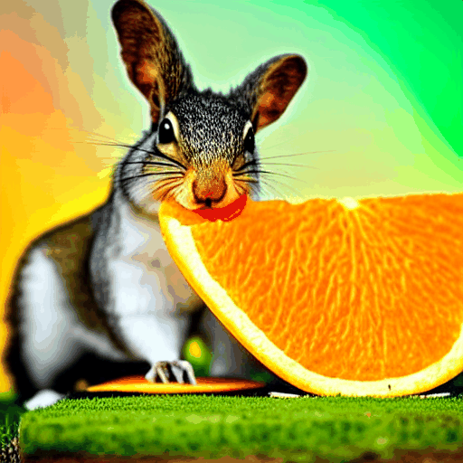

# Ground-A-Video: Zero-shot Grounded Video Editing using Text-to-image Diffusion Models

This repository contains the official pytorch implementation of [Ground-A-Video](#).
<br/> <br/>
[](https://ground-a-video.github.io/)

## 🌱 Abstract
<b><font color="red">Ground A Video</font> is the first groundings-driven video editing.<br>
<font color="red">Ground A Video</font> is the first video editing framework that integrates spatially-continuous and spatially-discrete conditions.<br>
<font color="red">Ground A Video</font> does not neglect edits, confuse edits, but does preserve non-target regions.<br>
:o: Pretrained Stable Diffusion |
:o: Optical Flow, Depth Map, Groundings |
:x: Any training</b>

<details><summary>Full abstract</summary>


> We introduce a novel groundings guided video-to-video translation framework called Ground-A-Video. Recent endeavors in video editing have showcased promising results in single-attribute editing or style transfer tasks, either by training T2V models on text-video data or adopting training-free methods. However, when confronted with the complexities of multi-attribute editing scenarios, they exhibit shortcomings such as omitting or overlooking intended attribute changes, modifying the wrong elements of the input video, and failing to preserve regions of the input video that should remain intact. Ground-A-Video attains temporally consistent multi-attribute editing of input videos in a training-free manner without aforementioned shortcomings. Central to our method is the introduction of cross-frame gated attention which incorporates groundings information into the latent representations in a temporally consistent fashion, along with Modulated Cross-Attention and optical flow guided inverted latents smoothing. Extensive experiments and applications demonstrate that Ground-A-Video's zero-shot capacity outperforms other baseline methods in terms of edit-accuracy and frame consistency.
</details>

## :memo: News
* [11/11/2023] The paper is currently under review process. We plan to make the code public once the process is done, since there could be not minor modifications.
  <br> (Apologies for the late release, but please stay tuned!)

## Teaser
<table class="center">
<tr>
  <td style="text-align:center;"><b>Input Video</b></td>
  <td style="text-align:center;"><b>Video Groundings</b></td>
  <td style="text-align:center;"><b>Depth Map</b></td>
  <td style="text-align:center;"><b>Optical Flow</b></td>
  <td style="text-align:center;"><b>Output Video</b></td>
</tr>

<tr>
  <td width=20% style="text-align:center;color:gray;">"A <ins>man</ins> is walking a <ins>dog</ins> on the <ins>road</ins>."</td>
  <td width=20% style="text-align:center;">man, dog, road</td>
  <td width=20% style="text-align:center;color:gray;">by ZoeDepth</td>
  <td width=20% style="text-align:center;">by RAFT-large</td>
  <td width=20% style="text-align:center;color:gray;">"<ins>Iron Man</ins> is walking a <ins>sheep</ins> on the <ins>lake</ins>."</td>
</tr>

<tr>
  <td style colspan="1"></td>
  <td style colspan="1"></td>
  <td style colspan="1"></td>  
  <td style colspan="1"></td> 
  <td style colspan="1"></td>  
</tr>


<tr>
  <td width=20% style="text-align:center;color:gray;">"A <ins>rabbit</ins> is eating a <ins>watermelon</ins> on the <ins>table</ins>."</td>
  <td width=20% style="text-align:center;">rabbit, watermelon, table</td>
  <td width=20% style="text-align:center;color:gray;">by ZoeDepth</td>
  <td width=20% style="text-align:center;">by RAFT-large</td>
  <td width=20% style="text-align:center;color:gray;">"A <ins>squirrel</ins> is eating an <ins>orange</ins> on the <ins>grass</ins>, <ins>under the aurora</ins>."</td>
</tr>

<tr>
  <td style colspan="1"></td>
  <td style colspan="1"></td>
  <td style colspan="1"></td>  
  <td style colspan="1"></td> 
  <td style colspan="1"></td>  
</tr>

</table>


## Setup

### Requirements

```shell
pip install -r requirements.txt
```

### Weights

```shell
git lfs install
git clone https://huggingface.co/gligen/gligen-inpainting-text-box
```
This command will locate the GLIGEN pretrained weights as "./gligen-inpainting-text-box/diffusion_pytorch_model.bin"  
Or you can download with web interface at [huggingface](https://huggingface.co/gligen/gligen-inpainting-text-box/tree/main).


## More Results
<table class="center">
  <tr>
    <td style="text-align:center;"><b>Input Videos</b></td>
    <td style="text-align:center;" colspan="1"><b>Output Videos</b></td>
  </tr>
  <tr>
    <td></td>
    <td></td>
  </tr>
  <tr>
    <td></td>
    <td></td>
  </tr>
  <tr>
    <td></td>
    <td></td>
  </tr>
  <tr>
    <td></td>
    <td></td>
  </tr>
  <tr>
    <td></td>
    <td></td>
  </tr>
 
  
</table>

## Shoutouts
* Ground-A-Video builds upon huge open-source projects:<br>
  [diffusers](https://github.com/huggingface/diffusers), [Stable Diffusion](https://github.com/Stability-AI/stablediffusion),
  [GLIGEN](https://github.com/gligen/GLIGEN), [ControlNet](https://github.com/lllyasviel/ControlNet), [GLIP](https://github.com/microsoft/GLIP), [RAFT](https://github.com/princeton-vl/RAFT).
  <br>Thank you for open-sourcing!<br>
* Evaluation of Ground-A-Video was made possible thanks to open-sourced SOTA baselines:<br>
  [Tune-A-Video](https://github.com/showlab/Tune-A-Video), [Control-A-Video](https://github.com/Weifeng-Chen/control-a-video), [ControlVideo](https://github.com/YBYBZhang/ControlVideo) and RunwayML's web-based product [Gen-1](https://research.runwayml.com/gen1)<br>
  Please check out their works too :) <br>
